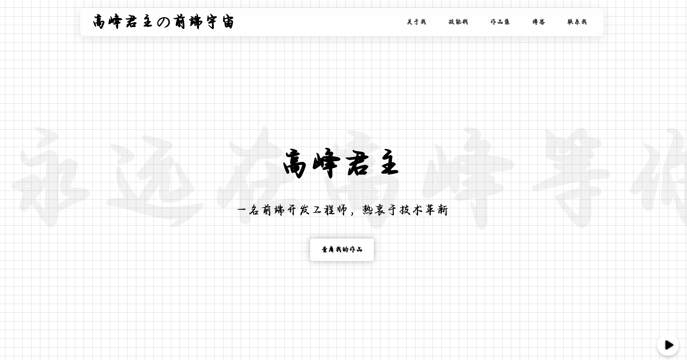

# Aura - 科技感个人网站主题

## 简介

**主题预览：** <mcurl name="https://home.gfjzz.cn" url="https://home.gfjzz.cn"></mcurl>
Aura 是一个充满科技感与未来主义风格的个人网站主题，旨在为您的在线形象注入独特的视觉魅力。主题融合了毛玻璃效果、流光粒子动画和动态发光效果，营造出一种沉浸式的数字“光环”。凭借其响应式设计和流畅的交互体验，Aura 主题将确保您的网站在各种设备上都能展现出最佳效果。

## 特点

*   **科技感设计:** 独特的视觉风格，结合毛玻璃、流光粒子和发光效果。
*   **响应式布局:** 完美适配桌面、平板和移动设备。
*   **平滑滚动:** 优雅的页面内部导航体验。
*   **逐字显示动画:** 吸引眼球的文本展示效果。
*   **背景音乐控制:** 可自定义的背景音乐播放/暂停功能。
*   **RSS 博客集成:** 轻松展示您的最新博客文章。
*   **可定制性:** 易于修改的样式和内容。

## 使用方法

1.  **下载主题:** 克隆或下载本仓库到您的本地。
2.  **部署:** 将文件上传到您的 Web 服务器或使用本地开发环境打开 `index.html`。
3.  **内容配置:**
    *   修改 `index.html` 文件中的个人信息、链接和内容。
    *   更新 `script.js` 中的 RSS 订阅源 URL。
4.  **样式定制:**
    *   修改 `style.css` 文件以调整颜色、字体、布局等样式。
    *   替换 `AiNiZaiHuangHunRiLuoShouXieTi-2.ttf` 文件以使用您自己的字体。
5.  **背景音乐:** 替换 `61tfq-qdrmd.mp3` 文件为您自己的背景音乐。
6.  **图片:** 替换 `placeholder-profile.jpg` 和 `sitelogo_new.png` 文件为您自己的图片。

## 作者博客

[君主阁](https://gfjzz.cn)

## 维护与贡献

如果您在使用过程中遇到任何问题或有改进建议，欢迎通过以下方式联系作者或提交 Pull Request：

*   **邮箱:** gfjz.0326@qq.com

如果您喜欢这个主题，请考虑给本项目点一个 Star ✨，这是对我最大的鼓励！

## 致谢

<h4>Webjing（提供改进建议）</h4>